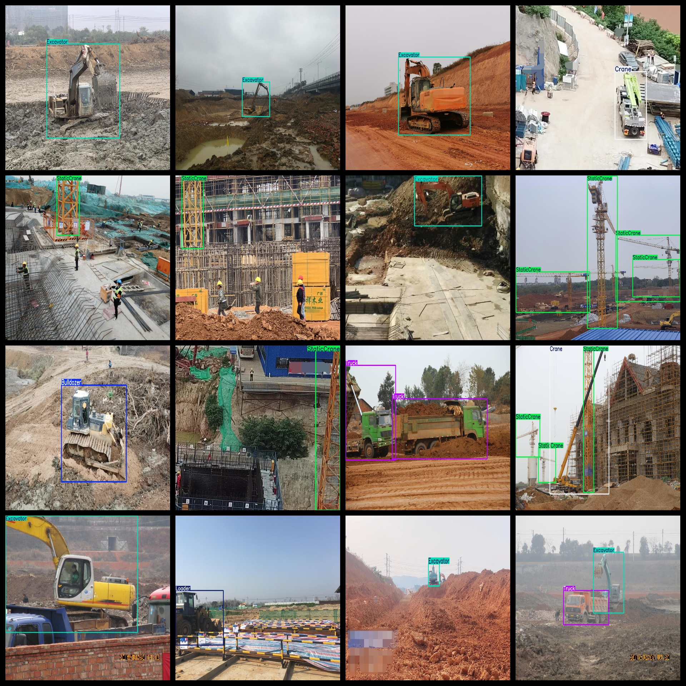

# This dataset contains 3189 images of construction site engineering machinery, including vehicles such as excavators, backhoes, bulldozers, and loaders. The dataset is in the VOC+YOLO format, which allows for easy integration into various machine learning models.

The construction site engineering vehicle and machinery dataset contains 3189 images in the VOC+YOLO format. This dataset does not include a split path in its text file, but it only contains JPG images along with their corresponding VOC format XML files and YOLO format TXT files.

The number of images (in jpg files): 3189

The number of annotations (in xml files): 3189

The number of annotations (in txt files): 3189

The number of annotation categories: 10

The repository containing this dataset is: datasets_sl

The label names for the annotation categories are as follows: ["Bulldozer", "ConcreteMixer", "Crane", "Excavator", "Loader", "PileDriving", "PumpTruck", "Roller", "StaticCrane", "Truck"]

Label Chinese translations: bulldozer, concrete mixer, crane, excavator, loader, pile driving, pump truck, roller, static crane, truck

Each category has been annotated with boxes:

Bulldozer boxes = 196

ConcreteMixer boxes = 206

Crane boxes = 287

Excavator boxes = 1790

Loader boxes = 163

PileDriving boxes = 205

PumpTruck boxes = 216

Roller boxes = 184

StaticCrane boxes = 1342

Truck boxes = 655

Total boxes = 5244

Each category owns the number of images:

Bulldozer owns images = 192

ConcreteMixer owns images = 195

Crane owns images = 269

Excavator owns images = 1525

Loader owns images = 161

PileDriving owns images = 131

PumpTruck owns images = 211

Roller owns images = 169

StaticCrane owns images = 812

Truck owns images = 525

Image resolution: 1200x900

Annotation tool used: labelImg

Dataset is not enhanced; training, validation, and test sets need to be divided by oneself.

Special note: this dataset does not guarantee any accuracy in the models trained or the weight files.

Annotations and image conditions are as follows:

## Images

---

Here is a pay link on Stripe (https://buy.stripe.com/3cs8yP7sY87d0vu9AB). Please contact me lonlonago@foxmail.com after funding $89, and I will send you a complete data files, thank you!

